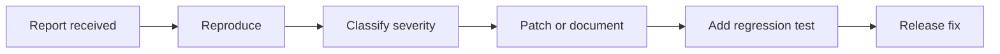

# Kryon Security Policy

This document describes how security reports and implementation issues should be handled for Kryon.

---

## Supported versions

| Version | Supported |
|---|---:|
| `1.0.x` | ✅ yes |
| `0.x` | historical only |

---

## Intended project scope

Kryon includes:

- streaming file digests;
- CLI checksums;
- manifest build/verify workflows;
- keyed digest helpers;
- domain/person separation helpers;
- Python, C, and Rust reference implementations;
- deterministic vectors and corpus checks;
- fuzzing and reduced-round analysis tools.

---

## Reporting a security issue

Please open a private security report or contact the maintainer with:

1. affected version;
2. affected component;
3. input vector, corpus case, or reduced-round profile;
4. expected behavior;
5. actual behavior;
6. reproduction steps;
7. estimated impact.

Useful attachments:

- minimal reproducer;
- digest values;
- compiler/runtime version;
- OS and architecture;
- crash log or sanitizer output.

---

## Severity guide

| Severity | Example |
|---|---|
| Critical | practical full-round collision/preimage shortcut, memory corruption in native ports |
| High | native parity mismatch, incorrect manifest verification, crash on valid input |
| Medium | CLI misuse issue, malformed input handling bug |
| Low | documentation error, unclear command, non-critical report formatting bug |

---

## Maintainer response flow

---

## Safe handling rules

- Do not publish practical exploit details before maintainers have time to review.
- Include a minimal test case when possible.
- Keep reports focused on reproducible behavior.
- For keys or tokens accidentally committed by users, rotate the secret first, then clean history.
