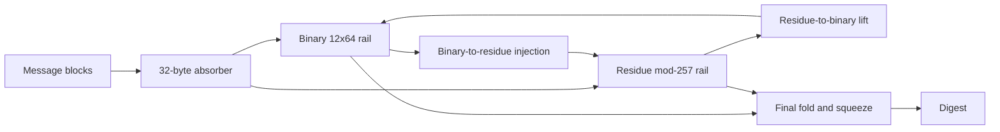

# Kryon v1.0 Specification

## 1. Parameters

| Parameter | Value |
|---|---:|
| Block size | 32 bytes |
| Output sizes | 256, 384, 512 bits |
| Binary state | 12 × 64-bit lanes |
| Residue state | 24 lanes modulo 257 |
| Default absorb rounds | 10 |
| Final absorb rounds | 14 |
| Final mix rounds | 16 |
| Post mix rounds | 6 |
| Version domain tag | `CRWEV202` internal 64-bit tag |

## 2. Construction idea

Kryon uses a dual-rail state:



The design avoids MD5-like 128-bit output and classic MD-style narrow chaining. It also avoids a plain sponge clone by maintaining two heterogeneous arithmetic rails that continuously inject into each other.

## 3. Padding

The final payload is:

```text
tail || 0x80 || zeroes || uint64_le(total_len) || uint32_le(out_bits) || "CW02"
```

The encoded final payload is a multiple of 32 bytes.

## 4. API stability

The canonical digest for v1.0 is byte-for-byte compatible with v0.2–v0.8. New v1.0 helpers are domain-separated wrappers and file/manifest tooling; they do not change canonical vectors.

## 5. Domain-separated helpers

`kryon.security` defines a framed wrapper:

```text
"CWDS1000" || len(label) || len(key) || len(personalization) || len(data) || label || key || personalization || data
```

The framed payload is then hashed by canonical Kryon. This prevents accidental collisions between different protocol uses, such as plain file hashing and keyed internal tags.

## 6. Implementation status

Kryon v1.0 includes the canonical Python implementation, CLI, file manifest tooling, keyed helpers, C reference port, Rust reference port, deterministic corpus, reduced-round analysis tools, parity checks, and release workflow.
