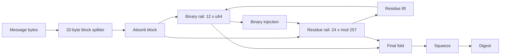

# Kryon Specification

> Version: **1.0.0**  
> Status: canonical software release

Kryon is a streaming one-way hash design with a dual-rail internal state. This document gives the implementation-facing specification used by the Python reference implementation and the native C/Rust ports.

---

## 1. Parameters

| Parameter | Value |
|---|---:|
| Block size | 32 bytes |
| Output sizes | 256, 384, 512 bits |
| Binary state | 12 × 64-bit lanes |
| Residue state | 24 lanes modulo 257 |
| Default absorb rounds | 10 |
| Final absorb rounds | 14 |
| Final mix rounds | 16 |
| Post mix rounds | 6 |
| Version tag | `0x4352574556323032` |
| Final trailer tag | `CW02` |

---

## 2. High-level construction



Kryon maintains two heterogeneous arithmetic views of the message state:

| Rail | Role |
|---|---|
| Binary rail | rotation, xor, addition, 64-bit diffusion |
| Residue rail | small-modulus mixing and cross-check entropy path |

Both rails are updated for every absorbed block and are folded together during finalization.

---

## 3. Input processing

Input is processed in 32-byte blocks. The streaming API stores incomplete data in an internal tail buffer and absorbs complete blocks immediately.

Required streaming behavior:

```text
hash(data) == hash(split(data, any valid chunk plan))
```

The implementation exposes this through:

```python
from kryon import new

h = new(out_bits=384)
h.update(b"part-1")
h.update(b"part-2")
digest = h.digest()
```

---

## 4. Padding and final block

Finalization builds this payload:

```text
tail || 0x80 || zeroes || uint64_le(total_len) || uint32_le(out_bits) || "CW02"
```

The payload is padded until it is a multiple of 32 bytes.

The final block injects:

- total message length;
- selected output size;
- final-block domain marker;
- version tag.

---

## 5. Output sizes

Kryon supports three canonical output sizes:

| Output | Bytes | Hex length |
|---|---:|---:|
| Kryon-256 | 32 | 64 |
| Kryon-384 | 48 | 96 |
| Kryon-512 | 64 | 128 |

The default CLI output is Kryon-384.

---

## 6. Domain-separated helpers

`kryon.security` defines a framed wrapper for domain-separated and keyed operations:

```text
"CWDS1000" || len(label) || len(key) || len(personalization) || len(data) || label || key || personalization || data
```

The framed payload is then passed to canonical Kryon.

Examples:

```python
from kryon import domain_hexdigest, keyed_hexdigest

domain_hexdigest("manifest", b"payload", 384)
keyed_hexdigest("secret", b"payload", 384, personalization="app-v1")
```

---

## 7. Canonical API

| API | Purpose |
|---|---|
| `digest(data, out_bits=384)` | one-shot binary digest |
| `hexdigest(data, out_bits=384)` | one-shot hex digest |
| `new(data=b"", out_bits=384)` | hashlib-like streaming context |
| `file_hexdigest(path, out_bits=384)` | streaming file digest |
| `verify_hexdigest(expected, data, out_bits=384)` | constant-time verification helper |

---

## 8. Native parity requirement

The C and Rust reference ports must match Python KAT vectors and corpus vectors.

| Port | Required checks |
|---|---|
| C | KAT runner, corpus runner |
| Rust | unit tests, KAT example, corpus example |

---

## 9. Version stability

The canonical Kryon v1.0 digest is byte-for-byte stable for the included KAT vectors. Any future change to padding, constants, permutation, or canonical digest output requires a major version bump.
